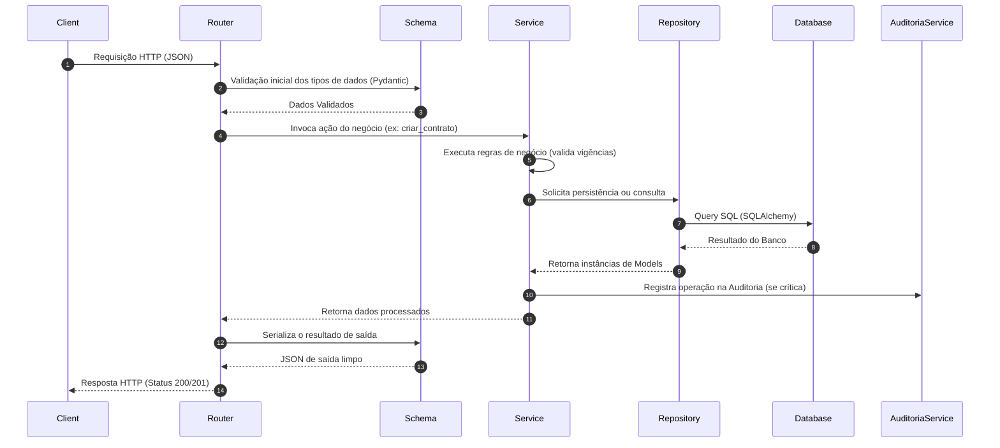

# Arquitetura — Torre de Controle Logtudo

Este documento descreve a arquitetura de software adotada para o backend da **Torre de Controle Logtudo**.

## Padrão Arquitetural: Monolito Modular (Modular Monolith)

Para conciliar a simplicidade de implantação de um MVP com a necessidade de escalabilidade e manutenibilidade futura, o sistema adota a arquitetura de **Monolito Modular**.

### Princípios Fundamentais
1. **Baixo Acoplamento**: Módulos possuem o mínimo de dependências uns com os outros. Quando há necessidade de comunicação intermódulo, esta deve ocorrer preferencialmente via serviços públicos específicos, evitando acoplamento direto nas tabelas ou repositories de outros módulos.
2. **Alta Coesão**: Todas as responsabilidades de um domínio de negócios específico (ex: gestão de motoristas) residem estritamente dentro do seu respectivo módulo.
3. **Barreira de Regras de Negócio**: Nenhuma regra de negócio deve residir nas rotas do FastAPI (routers). Os routers servem apenas como adaptadores HTTP que recebem dados, validam o formato via Pydantic e delegam a execução para os serviços.

---

## Estrutura de Diretórios

A estrutura interna da aplicação segue a organização abaixo:

```text
app/
├── main.py                     # Ponto de entrada do FastAPI
├── core/                       # Infraestrutura global e utilitários
│   ├── config.py               # Configurações de variáveis de ambiente
│   ├── database.py             # Conexão e sessão do SQLAlchemy
│   ├── security.py             # Utilitários de hash e tokens JWT
│   └── datetime_utils.py       # Utilitários de timezone (America/Bahia)
├── auth/                       # Módulo de Autenticação
├── usuarios/                   # Módulo de Gestão de Usuários
├── empresas/                   # Módulo de Gestão de Empresas
├── contratos/                  # Módulo de Regras Contratuais e Vigências
├── motoristas/                 # Módulo de Gestão de Motoristas
├── veiculos/                   # Módulo de Gestão de Veículos
├── agendamentos/               # Módulo de Agendamentos (futuro)
├── operacao/                   # Módulo de Operações (futuro)
├── auditoria/                  # Módulo de Auditoria estruturada
└── configuracoes/              # Configurações globais adicionais (se houver)
```

---

## Organização Interna de um Módulo

Cada módulo de negócio no sistema é auto-contido e possui a seguinte estrutura de arquivos:

```text
app/modulo/
├── __init__.py
├── models.py                   # Entidades e mapeamento ORM do SQLAlchemy
├── schemas.py                  # Modelos Pydantic para validação de entrada/saída
├── repositories.py             # Camada de acesso ao banco de dados (consultas SQL)
├── services.py                 # Camada de regras de negócio e validações
└── routers.py                  # Endpoints expostos (rotas FastAPI)
```

### Papel de Cada Camada

*   **`models.py` (Models)**: Representa estritamente o esquema de tabelas relacionais do PostgreSQL usando o SQLAlchemy Declarative Mapping. Contém apenas relacionamentos e definições de campos.
*   **`schemas.py` (Schemas)**: Define contratos de dados usando Pydantic. Valida tipos, formatos de strings e limites antes que os dados cheguem à camada de serviço, e filtra a saída para ocultar dados confidenciais (como hashes de senhas).
*   **`repositories.py` (Repositories)**: Isolam a camada de dados. Toda consulta SQL, filtros complexos e manipulação direta de `db.session` deve ser executada aqui. Isso facilita mocks em testes unitários.
*   **`services.py` (Services)**: Contém toda a lógica de negócios da aplicação. Validações de domínio complexas (como vigência de contratos, disponibilidade de motoristas) e chamadas de auditoria residem nesta camada.
*   **`routers.py` (Routers)**: Define as rotas do FastAPI, injeta dependências de sessão do banco de dados e chama os serviços adequados. Trata exceções do domínio de forma a convertê-las em respostas HTTP corretas (ex: 400 Bad Request, 404 Not Found).

---

## Fluxo de Execução Típico


