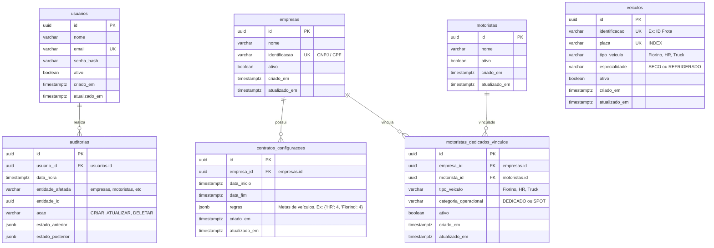

# Modelagem de Banco de Dados — Torre de Controle Logtudo

Este documento detalha o modelo físico de dados, a modelagem das entidades, a estratégia de chaves primárias e os tipos de dados adotados para o PostgreSQL.

## Diretrizes do Banco de Dados

1.  **Identificadores únicos (UUID)**: Todas as tabelas utilizam UUID v4 como chave primária (`id`). Para persistência e geração no banco, será utilizada a extensão `pgcrypto` com a função `gen_random_uuid()` no PostgreSQL.
2.  **Datas e Timezones**: Todos os campos de data/hora utilizam o tipo `TIMESTAMP WITH TIME ZONE` (`TIMESTAMPTZ`). As triggers/defaults de criação utilizam o UTC como padrão interno de armazenamento. A conversão de fuso horário para o fuso local (`America/Bahia`) é tratada na camada de serialização/deserialização (Pydantic) e exibição da API.
3.  **Auditoria Avançada**: A tabela de auditoria utiliza o tipo nativo `JSONB` do PostgreSQL para armazenar os campos `estado_anterior` e `estado_posterior`, garantindo queries de histórico eficientes.

---

## Modelo Entidade-Relacionamento (ERD)

---

## Dicionário de Dados Detalhado

### 1. Tabela: `usuarios`
Armazena os usuários do sistema com acesso ao backend.

| Campo | Tipo | Restrições | Descrição |
| :--- | :--- | :--- | :--- |
| `id` | `UUID` | PRIMARY KEY, Default: `gen_random_uuid()` | Identificador único do usuário. |
| `nome` | `VARCHAR(255)` | NOT NULL | Nome completo do usuário. |
| `email` | `VARCHAR(255)` | NOT NULL, UNIQUE, INDEX | E-mail corporativo (usado para login). |
| `senha_hash` | `VARCHAR(255)` | NOT NULL | Hash seguro da senha (gerado com bcrypt). |
| `ativo` | `BOOLEAN` | NOT NULL, Default: `true` | Indica se o usuário está ativo no sistema. |
| `criado_em` | `TIMESTAMPTZ` | NOT NULL, Default: `now()` | Timestamp de criação. |
| `atualizado_em` | `TIMESTAMPTZ` | NOT NULL, Default: `now()` | Timestamp de atualização da última alteração. |

### 2. Tabela: `empresas`
Parceiros de negócios / transportadoras.

| Campo | Tipo | Restrições | Descrição |
| :--- | :--- | :--- | :--- |
| `id` | `UUID` | PRIMARY KEY, Default: `gen_random_uuid()` | Identificador único da empresa. |
| `nome` | `VARCHAR(255)` | NOT NULL | Nome fantasia ou razão social da empresa. |
| `identificacao` | `VARCHAR(18)` | NOT NULL, UNIQUE, INDEX | Registro identificador único (ex: CNPJ). |
| `ativo` | `BOOLEAN` | NOT NULL, Default: `true` | Indica se a empresa está ativa no sistema. |
| `criado_em` | `TIMESTAMPTZ` | NOT NULL, Default: `now()` | Timestamp de criação. |
| `atualizado_em` | `TIMESTAMPTZ` | NOT NULL, Default: `now()` | Timestamp de atualização da última alteração. |

### 3. Tabela: `motoristas`
Profissionais de transporte cadastrados.

| Campo | Tipo | Restrições | Descrição |
| :--- | :--- | :--- | :--- |
| `id` | `UUID` | PRIMARY KEY, Default: `gen_random_uuid()` | Identificador único do motorista. |
| `nome` | `VARCHAR(255)` | NOT NULL | Nome completo do motorista. |
| `ativo` | `BOOLEAN` | NOT NULL, Default: `true` | Indica se o motorista está ativo no sistema. |
| `criado_em` | `TIMESTAMPTZ` | NOT NULL, Default: `now()` | Timestamp de criação. |
| `atualizado_em` | `TIMESTAMPTZ` | NOT NULL, Default: `now()` | Timestamp de atualização da última alteração. |

### 4. Tabela: `veiculos`
Frota cadastrada no sistema.

| Campo | Tipo | Restrições | Descrição |
| :--- | :--- | :--- | :--- |
| `id` | `UUID` | PRIMARY KEY, Default: `gen_random_uuid()` | Identificador único do veículo. |
| `identificacao` | `VARCHAR(100)`| NOT NULL, UNIQUE | Identificador de frota ou código interno do veículo. |
| `placa` | `VARCHAR(7)` | NOT NULL, UNIQUE, INDEX | Placa Mercosul ou padrão antigo. |
| `tipo_veiculo` | `VARCHAR(100)`| NOT NULL | Tipo do veículo (ex: "Fiorino", "HR", "Truck"). |
| `especialidade` | `VARCHAR(50)` | NOT NULL, Constraint: `SECO` ou `REFRIGERADO` | Especialidade térmica do veículo. |
| `ativo` | `BOOLEAN` | NOT NULL, Default: `true` | Indica se o veículo está ativo no sistema. |
| `criado_em` | `TIMESTAMPTZ` | NOT NULL, Default: `now()` | Timestamp de criação. |
| `atualizado_em` | `TIMESTAMPTZ` | NOT NULL, Default: `now()` | Timestamp de atualização da última alteração. |

### 5. Tabela: `contratos_configuracoes`
Contratos de regras operacionais de empresas com definição de vigência.

| Campo | Tipo | Restrições | Descrição |
| :--- | :--- | :--- | :--- |
| `id` | `UUID` | PRIMARY KEY, Default: `gen_random_uuid()` | Identificador único da configuração. |
| `empresa_id` | `UUID` | FOREIGN KEY -> `empresas.id`, NOT NULL | Empresa vinculada à configuração. |
| `data_inicio` | `TIMESTAMPTZ` | NOT NULL | Data de início de vigência desta configuração. |
| `data_fim` | `TIMESTAMPTZ` | NULLABLE | Data de término da vigência (nula = tempo indeterminado). |
| `regras` | `JSONB` | NOT NULL | Regras de veículos dedicados (ex: `{"HR": 4, "Fiorino": 4, "Truck": 2}`). |
| `criado_em` | `TIMESTAMPTZ` | NOT NULL, Default: `now()` | Timestamp de criação. |
| `atualizado_em` | `TIMESTAMPTZ` | NOT NULL, Default: `now()` | Timestamp de atualização da última alteração. |

*Índice temporal especial:* Criação de índice composto `(empresa_id, data_inicio, data_fim)` para otimização de consultas de vigência de contrato.

### 6. Tabela: `motoristas_dedicados_vinculos`
Vínculo persistente de um motorista a uma empresa e a um tipo de veículo/categoria operacional.

| Campo | Tipo | Restrições | Descrição |
| :--- | :--- | :--- | :--- |
| `id` | `UUID` | PRIMARY KEY, Default: `gen_random_uuid()` | Identificador único do vínculo. |
| `empresa_id` | `UUID` | FOREIGN KEY -> `empresas.id`, NOT NULL | Empresa do vínculo. |
| `motorista_id` | `UUID` | FOREIGN KEY -> `motoristas.id`, NOT NULL, UNIQUE | Motorista associado (um motorista dedicado só pode ter um vínculo ativo). |
| `tipo_veiculo` | `VARCHAR(100)`| NOT NULL | Tipo de veículo operado pelo motorista no contrato. |
| `categoria_operacional`| `VARCHAR(50)`| NOT NULL | Categoria: `DEDICADO` ou `SPOT`. |
| `ativo` | `BOOLEAN` | NOT NULL, Default: `true` | Indica se o vínculo está ativo. |
| `criado_em` | `TIMESTAMPTZ` | NOT NULL, Default: `now()` | Timestamp de criação. |
| `atualizado_em` | `TIMESTAMPTZ` | NOT NULL, Default: `now()` | Timestamp de atualização da última alteração. |

### 7. Tabela: `auditorias`
Trilha de auditoria detalhada de modificações de estado do sistema.

| Campo | Tipo | Restrições | Descrição |
| :--- | :--- | :--- | :--- |
| `id` | `UUID` | PRIMARY KEY, Default: `gen_random_uuid()` | Identificador único da auditoria. |
| `usuario_id` | `UUID` | FOREIGN KEY -> `usuarios.id`, NULLABLE | Usuário que gerou a alteração (nulo para sistema). |
| `data_hora` | `TIMESTAMPTZ` | NOT NULL, Default: `now()` | Data/hora do evento em UTC. |
| `entidade_afetada`| `VARCHAR(100)`| NOT NULL | Nome da tabela/entidade modificada. |
| `entidade_id` | `UUID` | NOT NULL | ID do registro afetado. |
| `acao` | `VARCHAR(50)` | NOT NULL | Tipo de ação executada: `CRIAR`, `ATUALIZAR`, `DELETAR`. |
| `estado_anterior`| `JSONB` | NULLABLE | JSON com o estado do registro antes da ação (nulo para `CRIAR`). |
| `estado_posterior`| `JSONB` | NULLABLE | JSON com o estado do registro após a ação (nulo para `DELETAR`). |
